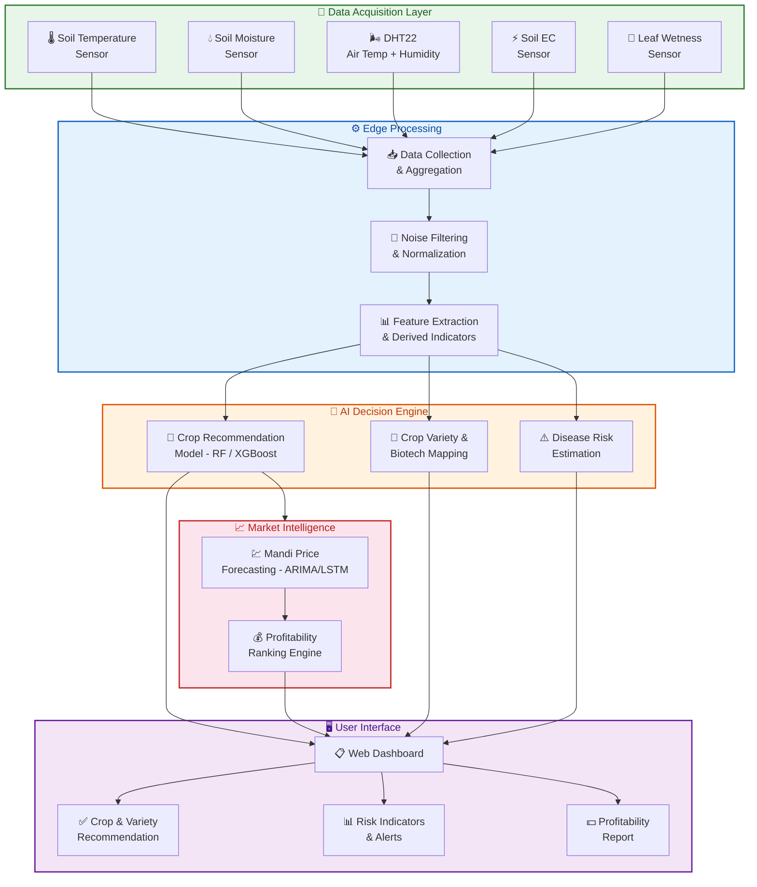

```mermaid
flowchart TD
    subgraph SENSORS["🌱 Data Acquisition Layer"]
        S1["🌡️ Soil Temperature<br>Sensor"]
        S2["💧 Soil Moisture<br>Sensor"]
        S3["🌬️ DHT22<br>Air Temp + Humidity"]
        S4["⚡ Soil EC<br>Sensor"]
        S5["🍃 Leaf Wetness<br>Sensor"]
    end

    subgraph EDGE["⚙️ Edge Processing"]
        E1["📥 Data Collection<br>& Aggregation"]
        E2["🔧 Noise Filtering<br>& Normalization"]
        E3["📊 Feature Extraction<br>& Derived Indicators"]
    end

    subgraph AI["🤖 AI Decision Engine"]
        A1["🌾 Crop Recommendation<br>Model - RF / XGBoost"]
        A2["🧬 Crop Variety &<br>Biotech Mapping"]
        A3["⚠️ Disease Risk<br>Estimation"]
    end

    subgraph MARKET["📈 Market Intelligence"]
        M1["💹 Mandi Price<br>Forecasting - ARIMA/LSTM"]
        M2["💰 Profitability<br>Ranking Engine"]
    end

    subgraph OUTPUT["🖥️ User Interface"]
        O1["📋 Web Dashboard"]
        O2["✅ Crop & Variety<br>Recommendation"]
        O3["📊 Risk Indicators<br>& Alerts"]
        O4["💵 Profitability<br>Report"]
    end

    S1 & S2 & S3 & S4 & S5 --> E1
    E1 --> E2 --> E3

    E3 --> A1
    E3 --> A2
    E3 --> A3

    A1 --> MARKET
    M1 --> M2

    A1 & A2 & A3 --> O1
    M2 --> O1

    O1 --> O2
    O1 --> O3
    O1 --> O4

    style SENSORS fill:#e8f5e9,stroke:#2e7d32,stroke-width:2px,color:#1b5e20
    style EDGE fill:#e3f2fd,stroke:#1565c0,stroke-width:2px,color:#0d47a1
    style AI fill:#fff3e0,stroke:#e65100,stroke-width:2px,color:#bf360c
    style MARKET fill:#fce4ec,stroke:#c62828,stroke-width:2px,color:#b71c1c
    style OUTPUT fill:#f3e5f5,stroke:#6a1b9a,stroke-width:2px,color:#4a148c
```
